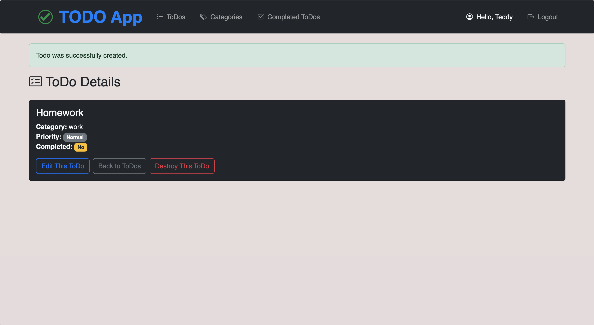

#  ToDo App - Final Project (COM214, Spring 2025)

A fully functional and visually polished TODO application built with Ruby on Rails, featuring user authentication, task management, and categorized organization. This project is deployed live on Render and developed collaboratively as part of the COM214 final project.

##  Live Demo

 [View the deployed app on Render](https://todo-app-wkma.onrender.com)

##  Team Members

- Teddy Taussig (@Tttaussig33)
- Nick Essery (@Nick-Essery)
- Evan Lyons (@EvanL77)

##  Features

###  User Authentication & Authorization
- Full sign-up and login functionality with `first_name`, `last_name`, `username`, `email`, and `password`.
- User-specific access: only logged-in users can manage their own ToDos and Categories.
- User greeting by first name across all authenticated pages.
- Users can delete their account, and all their ToDos and Categories will also be deleted.

###  Categories Management
- Users can create and manage categories with `name` and `description`.
- `/categories` displays all user's categories.
- `/categories/:id` shows category details and lists associated ToDos.
- Edit and delete category options available; deleting a category also removes its ToDos.

###  ToDo Items
- Fields: `title`, `priority` (boolean), `completed` (boolean), `category_id`.
- `/todos` lists all user's ToDos.
- `/todos/completed` shows completed tasks only.
- Distinct visual indicators for priority and completed tasks using Bootstrap.
- Each ToDo links to detail, edit, and delete pages.

###  Design Components
- Full Bootstrap-based responsive design.
- Custom CSS for polished visuals.
- Font-Awesome or Bootstrap icons used throughout for UI clarity.

##  How to Run Locally

1. **Clone the repo**  
   `git clone https://github.com/Tttaussig33/ToDo-App.git`

2. **Install dependencies**  
   `bundle install`

3. **Set up the database**  
   `bin/rails db:migrate`

4. **Run the server**  
   `bin/rails server`  
   Visit `http://localhost:3000` in your browser.

### Requirements
- Ruby 3.4.1
- Rails 7.2.2.1
- SQLite3

## Submission

- GitHub Repository: [https://github.com/Tttaussig33/ToDo-App](https://github.com/Tttaussig33/ToDo-App)
- Render Deployment: [https://todo-app-wkma.onrender.com](https://todo-app-wkma.onrender.com)
- [Include your .mov or .mp4 demo video link here or indicate it]()
